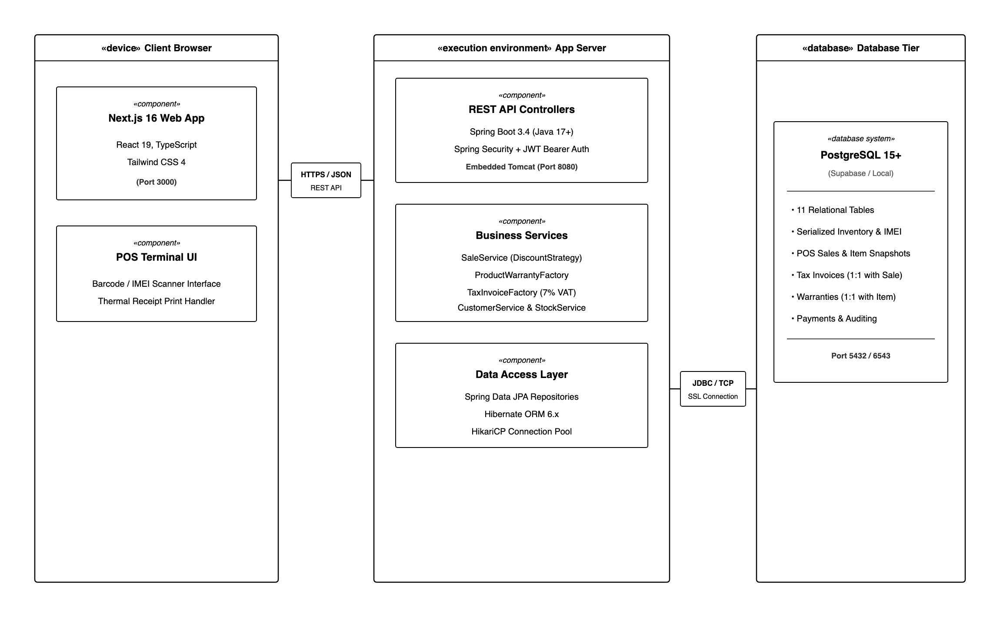
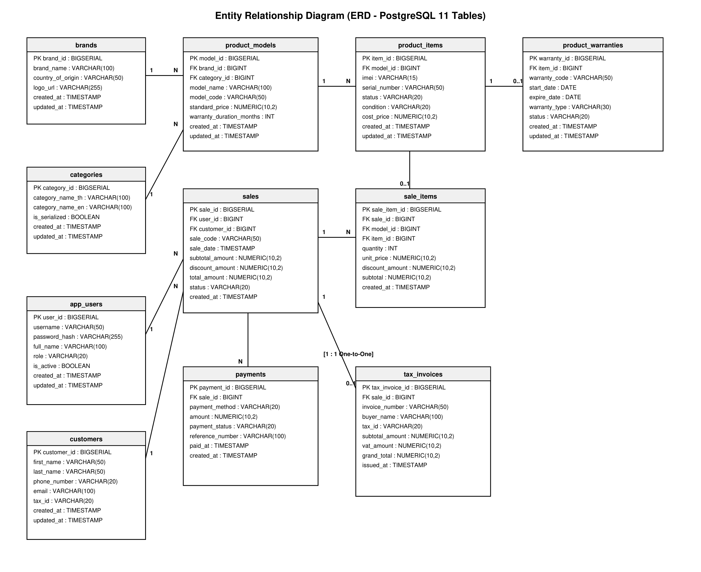

# MobiStock X

ระบบบริหารจัดการร้านค้าปลีกสินค้าอิเล็กทรอนิกส์/โทรศัพท์มือถือ

## สมาชิกกลุ่ม

| ลำดับ | ชื่อ-นามสกุล        | รหัสนักศึกษา | Section | Branch                  | หน้าที่รับผิดชอบ |
| ----- | ------------------- | ------------ | ------- | ----------------------- | ---------------- |
| 1     | กิตติชัย รักษาวงค์ | 673380028-2  | 02      | kittichai_6733800282_02 | PM + DevOps + Frontend    |
| 2     | พรรษพร มุสันเทียะ   | 673380051-7  | 02      | patsaporn_6733800517_02 | Frotend + UX/UI          |
| 3     | พิยดา เกษมาลา       | 673380052-5  | 02      | piyada_6733800525_02    | Frontend + UX/UI         |
| 4     | สรวิทญ์ ทัศดร่      | 673380065-6  | 02      | sorawit_6733800656_02   | Backend + QA     |
| 5     | เอกรินทร์ บุดดาหลู่ | 673380074-5  | 02      | aekkarin_6733800745_02  | Backend + SA     |

## Tech Stack

**Frontend**
`Next.js` · `React` · `TypeScript`

**Backend**
`Spring Boot` · `Java`

**Database**
`Supabase` · `PostgreSQL`

**DevOps**
`Docker` · `GitHub Actions` · `Cloudflare Tunnel`
[](https://postimg.cc/c6nKxj85)

## System Architecture

ระบบพัฒนาตามสถาปัตยกรรม **Layered Architecture** แบบทิศทางเดียว (Unidirectional Flow) อย่างเคร่งครัด โดยแบ่งแยกหน้าที่และความรับผิดชอบในแต่ละ Layer:

```text
Presentation Layer (Controller / REST API)
       ↓
Service Layer (Business Logic & @Transactional)
       ↓
Repository Layer (Spring Data JPA)
       ↓
Domain Entity Layer (JPA Entities, Enums, Value Objects)
```

- **Presentation Layer (`controller/api`):** รับ-ส่งข้อมูลผ่าน Request/Response DTO เท่านั้น ห้ามส่งคืน JPA Entity ออกสู่ภายนอก
- **Service Layer (`service/impl`):** จัดการ Business Logic, ตรวจสอบสถานะสต็อก, คำนวณภาษี และควบคุม Database Transaction
- **Repository Layer (`repository`):** อินเทอร์เฟซ Spring Data JPA จัดการการสืบค้นข้อมูล
- **Domain Layer (`domain/entity`):** ความสัมพันธ์เชิงวัตถุ (ORM) โดยใช้ `FetchType.LAZY` และ Auditing Entity Listener



- **เอกสารอ้างอิงเพิ่มเติม:**
  - [การวิเคราะห์ Design Patterns (doc/design-patterns.md)](doc/design-patterns.md)
  - [การวิเคราะห์หลักการ SOLID Principles (doc/solid-analysis.md)](doc/solid-analysis.md)

## Database Design (ER Diagram)

ฐานข้อมูลเชิงสัมพันธ์ประกอบด้วย 11 ตารางหลัก พร้อมความสัมพันธ์ One-to-One, One-to-Many และ Many-to-Many (Associative Entity) ครบถ้วน:



- **One-to-One (1:1):** `sale_order` ── `tax_invoice` (Foreign Key: `sale_id` กำหนด `UNIQUE`), `sale_order_item` ── `product_warranty` (Foreign Key: `sale_item_id` กำหนด `UNIQUE`)
- **One-to-Many (1:N):** `brand` ──< `product_model`, `category` ──< `product_model`, `product_model` ──< `product_item`, `customer` ──< `sale_order`, `sale_order` ──< `payment`
- **Associative Entity (M:N):** `sale_order_item` เชื่อมโยงระหว่าง `sale_order` กับ `product_model` / `product_item` (จัดเก็บ Snapshot ราคาประวัติศาสตร์ ณ ขณะขาย)
- **เอกสารอ้างอิงเพิ่มเติม:** [พจนานุกรมข้อมูล (doc/data_dictionary.md)](doc/data_dictionary.md)

## Installation & Setupg

### Frontend

```bash
cd code/frontend
cp .env.example .env
npm install
# http://localhost:3000
```

### Backend

```bash
cd code/backend

export DB_URL=jdbc:postgresql://localhost:5432
export DB_USERNAME=postgres
export DB_PASSWORD=
```

## How to Run

### Frontend

```bash
cd code/frontend
npm run dev
```

### Backend

```bash
cd code/backend
./gradlew bootRun
```

### ข้อมูลทดสอบระบบเริ่มต้น (Default Test Accounts จาก DataSeeder)

| ผู้ใช้งาน (Username) | รหัสผ่าน (Password) | บทบาท (Role) | หน้าที่ |
| :--- | :--- | :--- | :--- |
| `admin` | `password` | `ADMIN` | ผู้ดูแลระบบ จัดการผู้ใช้และแบรนด์/หมวดหมู่ |
| `cashier1` | `password` | `SALES` | พนักงานขาย จุดชำระเงิน POS และออกใบกำกับภาษี |
| `technician1` | `password` | `TECHNICIAN` | ช่างเทคนิค ตรวจสอบประกันและเคลมสินค้า |
| `inventory1` | `password` | `INVENTORY` | พนักงานคลัง รับสินค้าเข้าสต็อกและเช็ก IMEI |

## API Documentation

- **Swagger UI Interactive Documentation:** `http://localhost:8080/swagger-ui.html`
- **OpenAPI 3 JSON Spec:** `http://localhost:8080/v3/api-docs`

### สรุป Resource-based REST API Endpoints

| Resource | HTTP Method | Path | คำอธิบาย |
| :--- | :---: | :--- | :--- |
| **Brands** | `GET` / `POST` / `PUT` / `DELETE` | `/api/v1/brands` | จัดการข้อมูลแบรนด์ (CRUD ครบถ้วน) |
| **Categories** | `GET` / `POST` / `PUT` / `DELETE` | `/api/v1/categories` | จัดการหมวดหมู่สินค้า (CRUD ครบถ้วน) |
| **Product Models** | `GET` / `POST` / `PUT` / `DELETE` | `/api/v1/products/models` | จัดการรุ่นสินค้า (CRUD + Pagination & Sorting) |
| **Product Items** | `GET` / `POST` / `PATCH` / `DELETE` | `/api/v1/products/items` | จัดการสต็อกรายเครื่อง (ค้นหาตาม IMEI, เปลี่ยนสถานะ) |
| **Customers** | `GET` / `POST` / `PUT` / `DELETE` | `/api/v1/customers` | จัดการข้อมูลลูกค้า (CRUD + ค้นหาตามเบอร์โทร) |
| **POS Sales** | `POST` / `GET` | `/api/v1/sales` | รายการขายหน้าร้าน (ตัดสต็อก, คำนวณ VAT 7%, ออกใบกำกับภาษี และสร้างประกันอัตโนมัติ) |

## How to Run Tests

ระบบมีชุด Automated Testing ครอบคลุมทั้ง Service Layer Unit Tests (Mockito) และ Controller Layer Integration Tests (MockMvc) รวมทั้งสิ้น **51 Tests ผ่าน 100%**:

```bash
cd code/backend
./gradlew test
```

- **Report Location:** `code/backend/build/reports/tests/test/index.html`

## Deployment URL

| บริการ | URL การเข้าใช้งาน | สถานะ |
| :--- | :--- | :---: |
| **Frontend Web App** | `https://mobistockx.dev` (หรือ Cloudflare Tunnel) | Ready |
| **Backend REST API** | `https://api.mobistockx.dev` | Ready |
| **Swagger UI** | `http://localhost:8080/swagger-ui.html` | Ready |
| **Cloud Database** | PostgreSQL on Supabase Cloud | Connected |

## Project Structure

โครงสร้างไดเรกทอรีของ Repository ตามข้อกำหนดของรายวิชา CP353002:

```text
MobiStockX/
├── code/                                # ซอร์สโค้ดและคอนฟิกูเรชันทั้งหมด
│   ├── backend/                         # Spring Boot 3 Backend
│   └── frontend/                        # Next.js / React Frontend
├── test/                                # ที่เก็บสคริปต์และการทดสอบเพิ่มเติม
├── doc/                                 # เอกสารการออกแบบและสไลด์นำเสนอ
│   ├── diagrams/                        # แผนภาพ UML และสถาปัตยกรรมระบบ
│   │   ├── 01_use_case/                 # Use Case Diagram & Draw.io
│   │   ├── 02_domain_model/             # Domain Model Diagram
│   │   ├── 03_class_diagram/            # Class Diagram
│   │   ├── 04_sequence_diagram/         # Sequence Diagrams (Login, Customer, POS)
│   │   ├── 05_activity_diagram/         # Activity Diagram
│   │   ├── 06_er_diagram/               # ER Diagram & Schema
│   │   ├── 07_component_and_deployment/ # Component & Deployment Diagram
│   │   └── 08_state_diagram/            # State Diagram (ItemStatus & SaleStatus)
│   ├── data_dictionary.md               # พจนานุกรมข้อมูล (Database Data Dictionary)
│   ├── design-patterns.md               # เอกสารวิเคราะห์การนำ Design Patterns มาใช้
│   ├── solid-analysis.md                # เอกสารวิเคราะห์หลักการ SOLID Principles
│   └── slide/                           # สไลด์นำเสนอโปรเจกต์
├── img/                                 # รูปภาพประกอบและสื่อมีเดีย
└── README.md                            # เอกสารแนะนำโปรเจกต์หลัก
```
