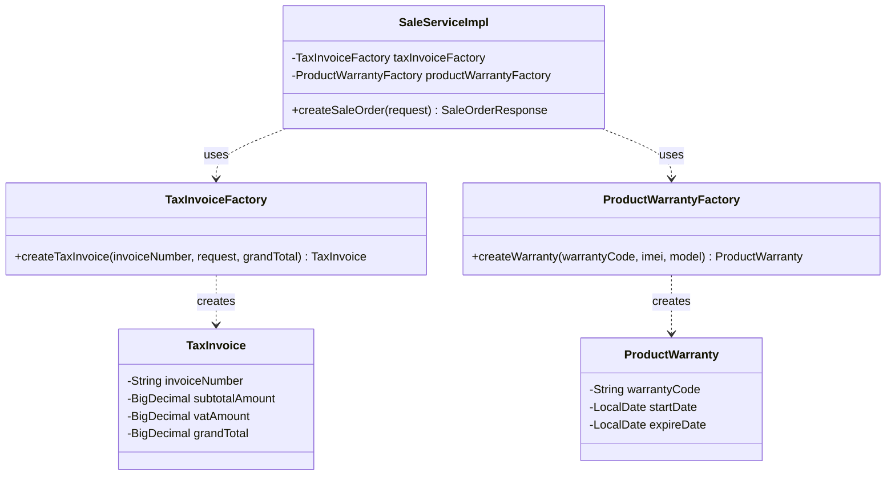
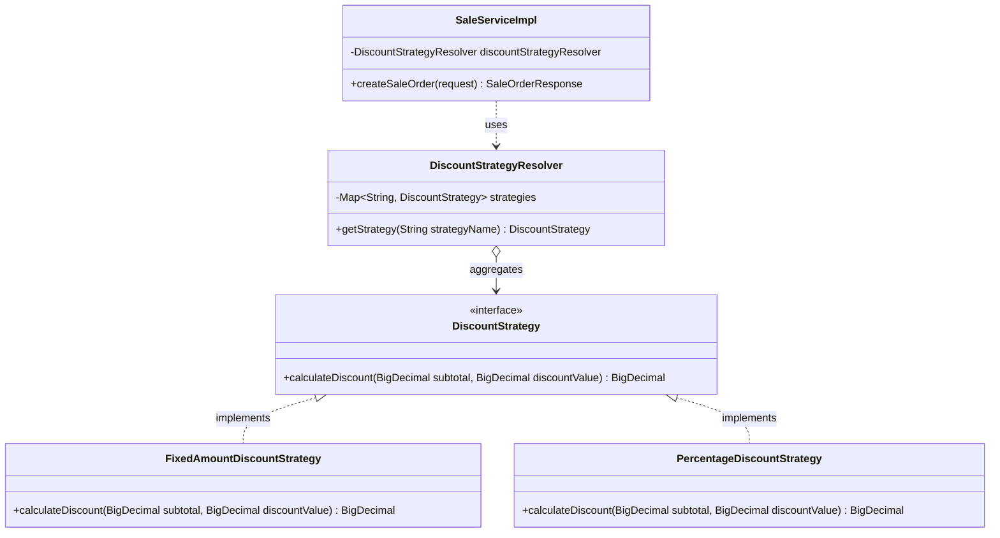
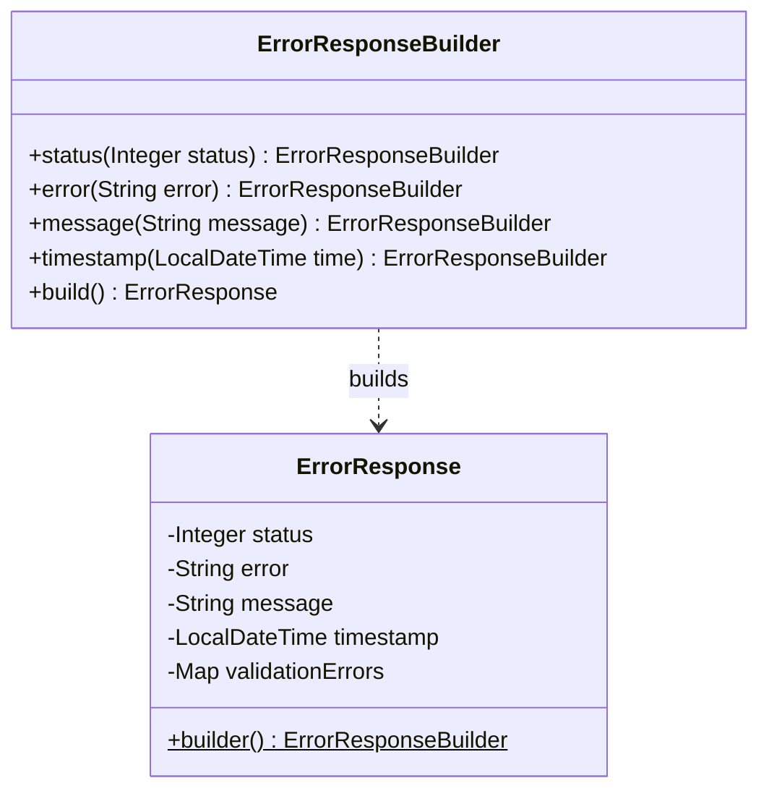

# เอกสารการประยุกต์ใช้ Design Patterns
**โปรเจกต์:** MobiStock X (ระบบบริหารจัดการร้านค้าปลีกสินค้าอิเล็กทรอนิกส์/โทรศัพท์มือถือ)  
**วิชา:** CP353002 Principles of Software Design and Development (Spring Boot)  

---

## 1. Enterprise / Architectural Patterns (บังคับทุกกลุ่ม)

| Architectural Pattern | ปัญหาที่แก้ไข (Problem Solved) | ไฟล์ / คลาสที่ใช้งาน (Files / Classes) |
|---|---|---|
| **Layered Architecture** | ป้องกันความสับสนในการเชื่อมต่อโค้ด แยก Presentation, Business Logic, และ Persistence ออกจากกันอย่างเด็ดขาด | - `controller/api/*` - `service/impl/*` - `repository/*` - `domain/entity/*` |
| **Model-View-Controller (MVC)** | แยกการจัดการ Request (Controller) ออกจาก Data Transfer Model และการแสดงผลบน Frontend | - `com.example.mobistock.controller.api.*` - `com.example.mobistock.dto.*` |
| **Repository Pattern** | ซ่อนรายละเอียดการเข้าถึง Database (SQL/HQL) ไว้เบื้องหลัง Interface ทำให้ง่ายต่อการ Mock ใน Unit Test | - `CustomerRepository` - `SaleOrderRepository` - `ProductItemRepository` - `AppUserRepository` |
| **Service Layer Pattern** | เป็นจุดรวม Business Logic, Validation ข้าม Domain, และจัดการขอบเขต Transaction (`@Transactional`) ในที่เดียว | - `CustomerServiceImpl` - `SaleServiceImpl` - `AuthServiceImpl` |
| **DTO Pattern & Data Mapper** | ป้องกัน Over-fetching / Under-fetching, ป้องกัน Entity Leak สู่ภายนอก และลด Coupling ระหว่าง Database Schema กับ API Contract | - `dto/request/*` - `dto/response/*` - `mapper/*` (เช่น `CustomerMapper`, `SaleMapper`) |
| **Dependency Injection (DI)** | ลดความผูกมัด (Decoupling) และสนับสนุนการทดสอบด้วย Constructor Injection | บังคับใช้ `@RequiredArgsConstructor` กับ `private final` ทุก Service และ Controller |

---

## 2. GoF Design Patterns (Gang of Four Patterns)

ระบบได้เลือกประยุกต์ใช้ **Creational Patterns** เป็นกลุ่มหลัก (3 รูปแบบ) พร้อมเสริมด้วย **Behavioral Patterns** ในส่วนการคำนวณราคา:

| หมวดหมู่ | GoF Pattern | ปัญหาที่แก้ไข (Problem Solved) | ไฟล์ / คลาสที่ใช้งาน (Files / Classes) |
|---|---|---|---|
| **Creational** | **Singleton Pattern** | จำกัดให้มี Instance เพียงหนึ่งเดียวตลอดอายุการทำงานของแอปพลิเคชัน เพื่อประหยัด Memory และควบคุมสถานะของระบบ | - Spring Managed Beans (`@Service`, `@Component`, `@Configuration`) - `CorsConfig`, `SecurityConfig`, `OpenApiConfig` |
| **Creational** | **Builder Pattern** | แก้ไขปัญหา Telescoping Constructor เมื่อ Entity หรือ Response DTO มีฟิลด์จำนวนมาก (เช่น `SaleOrder`, `TaxInvoice`, `ProductItem`) ช่วยให้สร้าง Object ได้ชัดเจนและ Immutability | - Lombok `@Builder` - `TaxInvoice.builder()` - `SaleOrder.builder()` - `ErrorResponse.builder()` |
| **Creational** | **Factory Method Pattern** | ซ่อนตรรกะการสร้าง Object ที่มีความซับซ้อน เช่น การคำนวณฐานภาษีมูลค่าเพิ่ม (VAT 7%) และการกำหนดระยะเวลารับประกันสินค้า | - `TaxInvoiceFactory` - `ProductWarrantyFactory` |
| **Behavioral** | **Strategy Pattern** | รองรับการคำนวณส่วนลดได้หลากหลายรูปแบบ (Fixed Amount, Percentage) โดยไม่ใช้ `if-else` ซ้อนกัน และเปิดให้เพิ่มโปรโมชันใหม่ได้ง่าย (Open/Closed Principle) | - `DiscountStrategy` (Interface) - `FixedAmountDiscountStrategy` - `PercentageDiscountStrategy` - `DiscountStrategyResolver` |

---

## 3. รายละเอียดและ Class Diagram ประกอบแต่ละ Pattern

### 3.1 Factory Method Pattern (TaxInvoice & ProductWarranty Creation)
**ปัญหาที่แก้:** ในการเปิดบิลขาย การออกใบกำกับภาษีต้องมีสูตรคำนวณภาษีแยกนอกและถอดภาษี 7% (Subtotal, VAT Rate, VAT Amount, Grand Total) หากเขียนปนอยู่ใน `SaleServiceImpl` จะทำให้คลาสบวมและละเมิด Single Responsibility จึงแยกตรรกะการสร้างออกเป็น Factory

---

### 3.2 Strategy Pattern (Discount Calculation)
**ปัญหาที่แก้:** ร้านค้ามีรูปแบบการให้ส่วนลดหลายวิธี (ส่วนลดตามจำนวนเงินคงที่, ส่วนลดเป็นเปอร์เซ็นต์ หรือในอนาคตอาจมีส่วนลดแต้มสะสม) การใช้ Strategy Pattern ช่วยให้สลับเปลี่ยนอัลกอริทึมได้ขณะ Runtime และเพิ่มคลาสใหม่ได้โดยไม่ต้องแก้ไขโค้ดเดิม

---

### 3.3 Builder Pattern (Data Encapsulation)
**ปัญหาที่แก้:** คลาสอย่าง `SaleOrder`, `TaxInvoice`, และ `ErrorResponse` มีข้อมูลหลายสิบฟิลด์ การสร้าง Object ผ่าน Parameterized Constructor ทำให้จำตำแหน่งพารามิเตอร์ผิดพลาดได้ง่าย Builder Pattern ช่วยให้อ่านโค้ดเข้าใจง่ายและป้องกันการสร้าง Object ในสถานะที่ไม่สมบูรณ์

